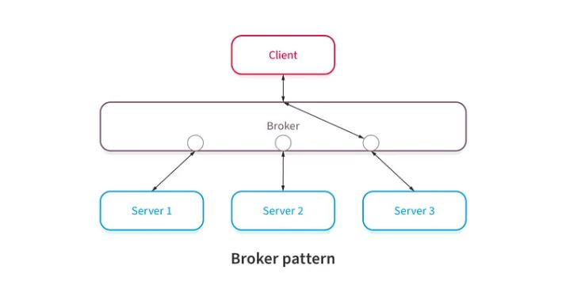

# Message Broker

A broker component coordinates requests and responses between clients and servers.
The broker has the details of the servers and the individual services they provide.
Clients send requests, and the broker finds the right server to route the request to.
It also sends the responses back to the clients. Servers can also send request to other server thouhgt the message broker.

Use case: https://learn.microsoft.com/en-us/azure/architecture/patterns/choreography

Tools: Redis 