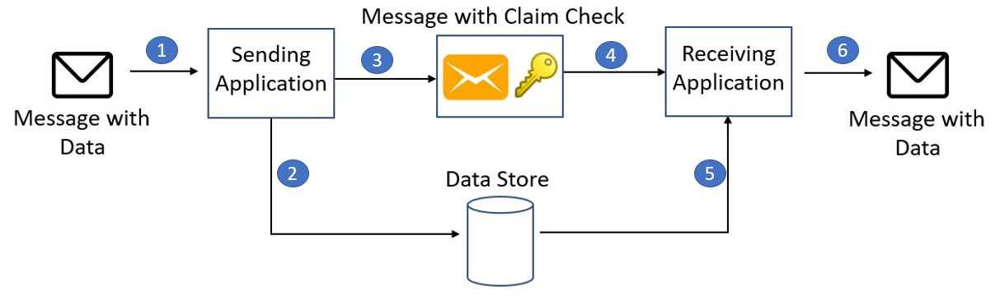

# Message Queue

A message queue is a communication mechanism that allows **asynchronous exchange of messages** between components within a distributed system. Messages are placed in a queue, enabling decoupled and reliable communication, where senders can produce messages and receivers can consume them at their own pace. 

Message queues facilitate efficient and **fault-tolerant** communication, making them essential for managing asynchronous events, tasks, and data flows in modern software architectures.

# Back Pressure 
It is the same as a messaging queue except that, when the queue is filled up, the  clients get a server busy or HTTP 503 status code to try again later.

Tools: Apache Kafka, RabbitMQ 

# Claim-Check pattern

Sending such large messages like images, sound files or text documents to the message bus directly is not recommended, because they require more resources and bandwidth to be consumed. Large messages can also slow down the entire solution, because messaging platforms are usually fine-tuned to handle huge quantities of small messages. Also, most messaging platforms have limits on message size, so you may need to work around these limits for large messages.

## Solution

Store the entire message payload into an external service, such as a database. Get the reference to the stored payload, and send just that reference to the message bus. The reference acts like a claim check used to retrieve a piece of luggage, hence the name of the pattern.

